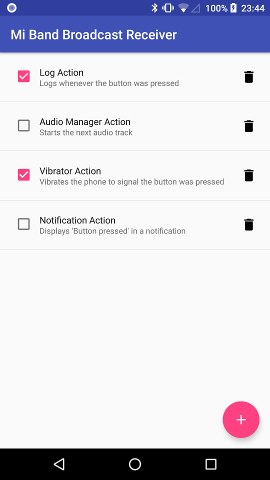

# mi-band-broadcast-receiver

This is a quickly implemented Android app to handle multiple actions when pressing the button on your mi band 2. Currently it supports logging the time of the button press, starting the next audio track, vibrating the phone and displaying a notification. All actions can be configured individually, for instance you may have two separate logs to measure your work- and freetime.

## License

The app is licensed under the [MIT license](LICENSE), so please feel free to adjust it to your needs.
